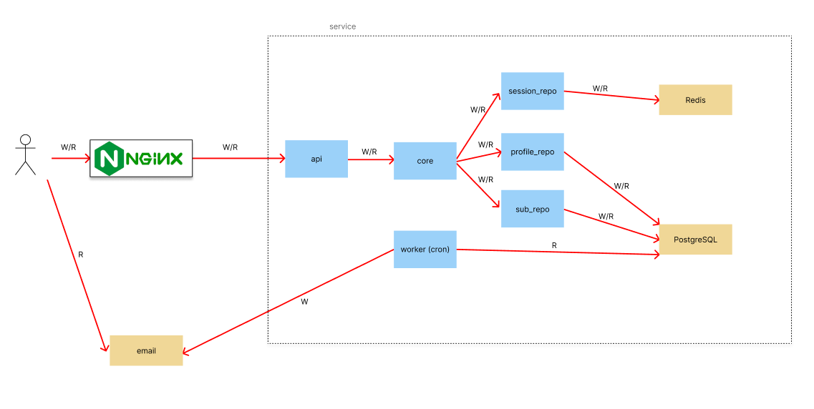

Приложение запускается командой:
```
make up
```
#### Описание проекта
В приложении реализована Чистая архитектура. Сам сервис является stateless.

Общение между браузером и сервисом авторизации происходит по REST API.

Api отвечает за обработку запросов, usecase за бизнес логику, repo за работу с БД.

Также присутствует контейнер c Nginx.

Реализована statefull авторизация. Для системы авторизации и сохранения сессий была выбрана бд кэширования Redis.

Для хранения данных о сотрудниках и подписках была выбрана бд PostgreSQL.

Оповещение с ДР приходит на почту сотрудникам. Раз в день через Cron идёт проверка у кого в этот день ДР, после чего отправляются оповещения на почты сотрудников.
ВАЖНО: для возможности отправки сообщений сотрудникам необохимо установить логин и пароль от аккаунта email в переменные среды .env (EMAIL_ADDRESS_SERVER, EMAIL_PASSWORD_SERVER)

#### Система каталогов

cmd - место запуска проекта.

configs - здесь мы получаем в виде структур данные, для подключения к БД.

images_readme - картинки с readme.

pkg - здесь расположены все нужные структуры для проекта.

scripts - здесь находится sql скрипт для БД

service - здесь расположен сам проект.

service/delivery/http - здесь расположен обработчик http запросов, api

service/usecase/core - бизнес-логика приложения 

service/usecase/worker - воркер, который работает через cron и проверяет раз в сутки у кого сегодня ДР.

service/repository - репозитории, в которых расположены подключения и запросы к бд

### Схема проекта


### Схема БД


### Авторизация
#### POST /signin
Результатом успешной авторизации является отдача cookie. Пример запроса: <br/>

### Регистрация
#### POST /signup
Результатом успешной регистрация является создание нового бользователя в БД. Пример запроса: <br/>


### Выход
#### DELETE /logout
Для выхода из аккаунта необходима кука session_id, которая была получена при авторизации. <br/>


### Проверка авторизации
#### GET /authcheck
Аутентификация пользователя. Проверка происходит по куке session_id. <br/>


### Вывод списка сотрудников
#### GET /api/v1/employees 
Количество сотрудников настраивается через query параметры. <br/>


### Подписка на оповещения о дне рожденья сотрудника
#### POST /api/v1/birthday/subscribe
В качестве параметров отправляется айди сотрудника, день рождения которого мы хотим знать. <br/>


### Отписка от оповещения о дне рожденья сотрудника
#### DELETE /api/v1/birthday/unsubscribe
В качестве параметров отправляется айди сотрудника. <br/>
